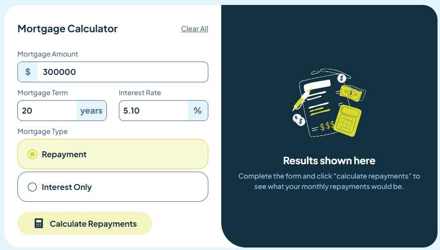

# Frontend Mentor - Mortgage repayment calculator solution

This is a solution to the [Mortgage repayment calculator challenge on Frontend Mentor](https://www.frontendmentor.io/challenges/mortgage-repayment-calculator-Galx1LXK73). Frontend Mentor challenges help you improve your coding skills by building realistic projects. 

## Table of contents

- [Overview](#overview)
  - [The challenge](#the-challenge)
  - [Screenshot](#screenshot)
  - [Links](#links)
- [My process](#my-process)
  - [Built with](#built-with)
  - [What I learned](#what-i-learned)
- [Author](#author)


## Overview

### The challenge

Users should be able to:

- Input mortgage information and see monthly repayment and total repayment amounts after submitting the form
- See form validation messages if any field is incomplete
- Complete the form only using their keyboard
- View the optimal layout for the interface depending on their device's screen size
- See hover and focus states for all interactive elements on the page

### Screenshot



### Links

- Solution URL: [Solution URL](https://your-solution-url.com)
- Live Site URL: [Live site URL](https://sonnen99.github.io/Challenge-mortgage-repayment-calculator-main/)

## My process

### Built with

- Semantic HTML5 markup
- CSS custom properties
- Bootstrap for card design
- @media breakpoints
- js and jQuery for functionality
- Desktop-first workflow
- Refactoring

### What I learned

```js
function checkComplete() {
    var variables = ['amount', 'years', 'rate'];
    var checked = true;
    for (var i = 0; i < variables.length; i++) {
        if ($('.' + variables[i]).val() === '') {
            error(variables[i], false);
            checked = false;
        } else if (isNaN($('.' + variables[i]).val())) {
            error(variables[i], true);
            checked = false;
        }
    }
    if ($('input[name=Mortgage]:checked').length === 0) {
        error('radio', false);
        checked = false;
    }
    return checked;
}

```

## Author
- Frontend Mentor - [sonnen99](https://www.frontendmentor.io/profile/sonnen99)